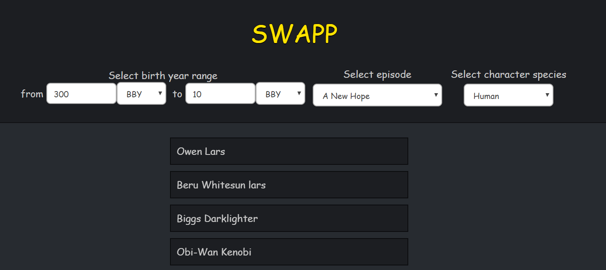

# swapp
Simple interface for SWAPI

This project was bootstrapped with [Create React App](https://github.com/facebook/create-react-app).

Click to see the demo: https://swapp-11045.web.app

Run in the project directory:

### `npm start`

To run this app in development mode.

## Filters

## Character details

