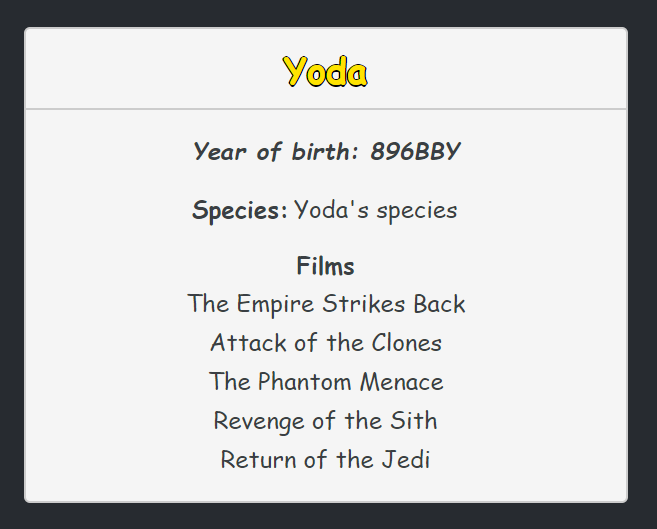

# swapp
Simple interface for SWAPI

This project was bootstrapped with [Create React App](https://github.com/facebook/create-react-app).

Run in the project directory:

### `npm start`

To run this app in development mode.

## Filters

#

## Character details

